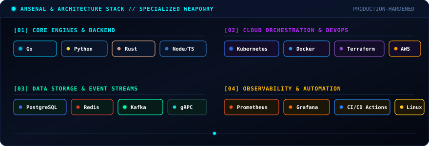

  <!-- ═══════════════════ NOVA OFFICIAL HERO BANNER ═══════════════════ -->
  

    

  <!-- ═══════════════════ EXECUTIVE TEAM BADGES ═══════════════════ -->
  

    
    
    
    
    
  

   

  <!-- ═══════════════════ NOVA STUDIO WORKSTATION BIO ═══════════════════ -->
  

    

  <!-- ═══════════════════ CLOUD RADAR & TELEMETRY ═══════════════════ -->
  

    

  <!-- ═══════════════════ ENGINEERING ARSENAL MATRIX ═══════════════════ -->
  

    

  <!-- ═══════════════════ LIVE GITHUB TELEMETRY & STATS ═══════════════════ -->
  <table width="100%" style="background-color: #070b16; border: 1px solid #1e293b; border-radius: 10px; margin-top: 10px;">
    <tr>
      <td align="center" style="padding: 18px;">
        <h3 style="color: #38bdf8; margin-top: 4px; margin-bottom: 12px; font-family: -apple-system, BlinkMacSystemFont, 'Segoe UI', Roboto, sans-serif; letter-spacing: 1.5px; font-size: 15px;">
          ⚡ NOVA TELEMETRY // REAL-TIME GITHUB ACTIVITY
        </h3>
        

          <!-- GitHub Stats Card -->
          
          <!-- GitHub Streak Stats -->
          
        

        

          <!-- Top Languages Card -->
          
        

      </td>
    </tr>
  </table>

    

  <!-- ═══════════════════ ANIMATED CONTRIBUTION STREAM ═══════════════════ -->
  <table width="100%" style="background-color: #070b16; border: 1px solid #1e293b; border-radius: 10px;">
    <tr>
      <td align="center" style="padding: 18px;">
        <h3 style="color: #10b981; margin-top: 4px; margin-bottom: 12px; font-family: -apple-system, BlinkMacSystemFont, 'Segoe UI', Roboto, sans-serif; letter-spacing: 1.5px; font-size: 15px;">
          🐍 COMMIT STREAM TELEMETRY (CONTRIBUTION SNAKE)
        </h3>
        

          
        

      </td>
    </tr>
  </table>

    

  <!-- ═══════════════════ FOOTER & CORPORATE QUOTE ═══════════════════ -->
  <table width="100%" style="background-color: #070b16; border: 1px solid #1e293b; border-radius: 10px;">
    <tr>
      <td align="center" style="padding: 22px;">
        

          <i>"Simplicity is the prerequisite for reliability. We engineer systems that scale effortlessly."</i>
        

        

          [ TEAM NOVA // ALL CLUSTERS OPERATIONAL // 2026 ]
        

      </td>
    </tr>
  </table>

